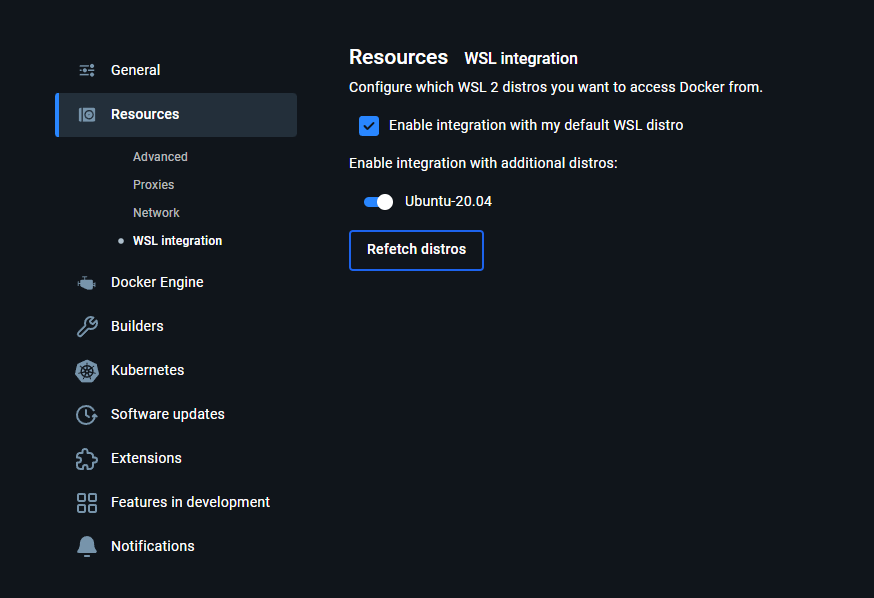

<p align="center">
  
</p>

# Repositório de Testes com Cypress

Este repositório contém a configuração necessária para executar testes automatizados utilizando o **Cypress**, uma ferramenta robusta para testes end-to-end.

# Dependencias
## Iniciando ambiente de desenvolvimento de testes
1 - Se estiver em ambiente Windows instale o Ubuntu como subsistema através do [WSL2](https://youtu.be/_Wp2nWtTBBY?t=109).

2 - Instale o [Docker Desktop](https://docs.docker.com/desktop/setup/install/windows-install/) (Windows) ou [Docker](https://www.digitalocean.com/community/tutorials/how-to-install-and-use-docker-on-ubuntu-20-04) e o [Docker Compose](https://www.digitalocean.com/community/tutorials/how-to-install-and-use-docker-compose-on-ubuntu-20-04) (Ubuntu).

2.2 - Se tiver problemas para rodar o Docker experimente atualizar o [windows para windows 11](https://www.microsoft.com/pt-br/software-download/windows11) 

3 - Através da loja do windows instale a ultima versão do Ubuntu (Windows).

4 - Nas configurações do Docker ative a integração com o wsl (Windows)




5 - Instale o [VScode](https://code.visualstudio.com/download)

6 - Instale o plugin para integração com o WSL


7 - Abra o terminal do VScode


# Rodar o Cypress
No terminal do VSCode na pasta cypress execute os seguintes comandos:

8 - Carregue algumas funções úteis e inicie os containers.
```
source start.sh
```

9 - As funções carregadas habilitam os seguintes comandos:

Para instalar o cypress
```
cypress install
```

Para rodar o cypress com interface gráfica
```
cypress open
```
Para rodar o cypress sem interface gráfica (somnete no terminal) 
```
cypress run
```

10 - A pasta onde ficam os testes separados por projeto
```
test/cypress/e2e
```
obs: Pode usar os testes do test/cypress/e2e/siastec como modelo
